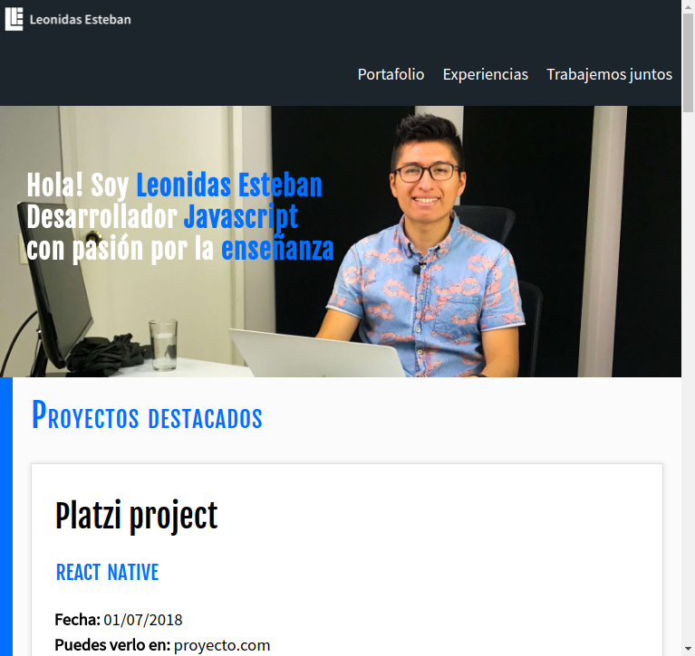
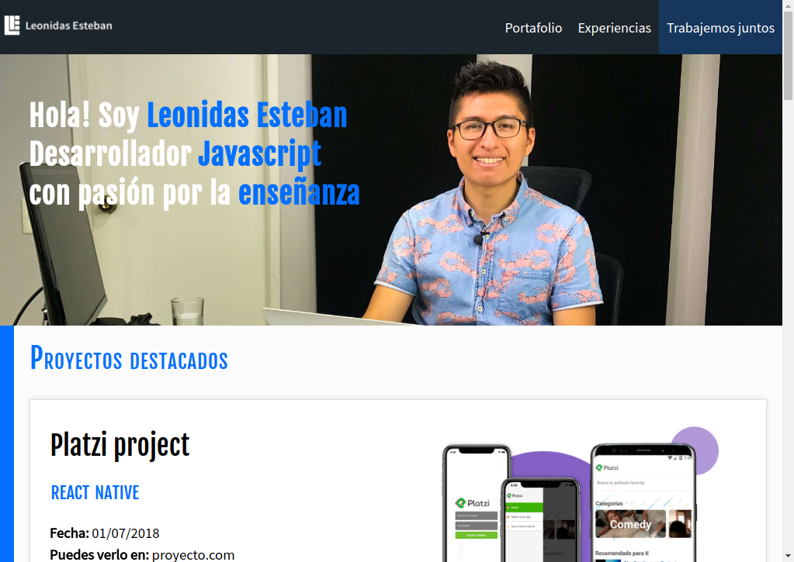
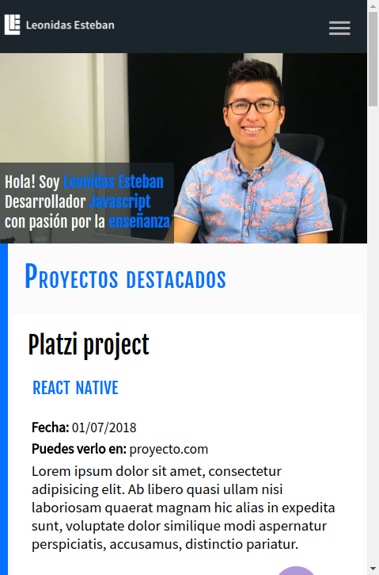

# Responsive design 2018, proyecto del curso

Es un simple ejemplo de sitio static responsive, que corre con un navegador moderno.

## Ver proyecto

Simplemente clona el proyecto y ejecuta index.html

## Licencia

MIT
